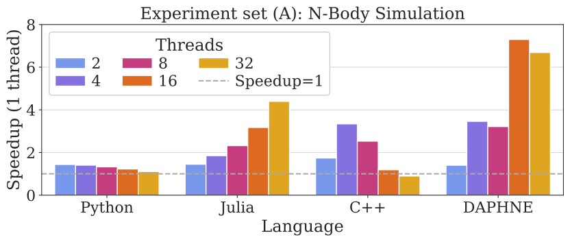
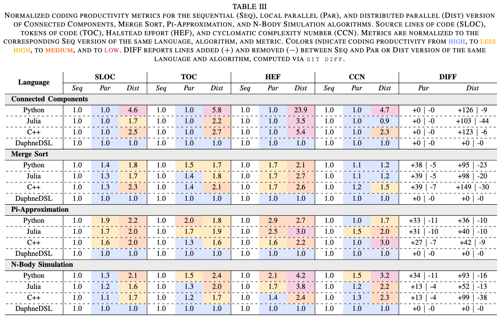

# Artifacts

The following is a description of artifacts for the paper *"A Comparative Study of Productivity and Performance of Four Programming Languages"* under review.

## Structure of the repository

### [Rebuttal](rebuttal)
Additional files for rebuttal following reviewers suggestions:  
- Speedup [plot examples](rebuttal/performance) and generator code[`plots.ipynb`](rebuttal/plots.ipynb)  
  Below is a representative speedup plot illustrating the normalized view (Speedup = 1 baseline indicated by dashed line).  
  
- Hardware [topology](rebuttal/topology.png) diagram (generated with ```lstopo```) of a typical compute node (AMD EPYC 7H12 64-Core Processor) on Vega.  
- [Differences](rebuttal/diff_results.txt) between benchmarks scripts.  
  Reading example:  
  ```=== mergesort | jl | seq vs par ===```  
  ```39	5	../benchmark_scripts/{mergesort-seq => mergesort-par}/jl/mergesort.jl```  
  Changing the **Julia** implementation for **Merge Sort** from **sequential** (_Sep_) to **local parallel** (_Par_) version required adding **39** lines and removing **5** lines.  
  ```MISSING``` denotes combinations where no corresponding version exists.  
- Revised [Table-III](rebuttal/Table-III.png) (only normailzed values but including diff-based code deltas) together with the LaTeX code generator [`script`](rebuttal/plots.ipynb).  
  
- Execution and affinity configuration clarification
  - Experiments were executed on exclusive nodes allocated via the cluster scheduler (Slurm).
  - No manual affinity or NUMA binding was specified in the application code.
  - MPI and OpenMP thread placement therefore followed the default binding policies of the cluster environment and the Open MPI runtime.
  - Compiler and MPI versions are documented in Table II of the paper.

### [Conda Environments](conda_envs)

- [`code_metrics.yml`](conda_envs/code_metrics.yml)
- [`snakemake.yml`](conda_envs/snakemake.yml)
- [`plotting.yml`](conda_envs/plotting.yml)  

To use them:  
```console
module load Anaconda
conda env create -f snakemake.yml 
conda activate snakemake
```


### [Benchmark Scripts](benchmark_scripts)

We implemented 4 different algorithms: Connected Components, Merge Sort, Pi-Approximation, and N-Body Simulation. The first requires a matrix as input, the other three not.

Each of the folder contains the code for the sequential (Seq), local parallel (Par) and distributed (`-mpi`, Dist) version of each algorithms.

In each folder, there is one folder per language (`cpp`, `daph`, `jl`, `py`), note that that there is no `daph` folder for the Par and Dist version, as those are the same as the sequential one.


### [Sbatch Scripts](sbatch_scripts)

This folder contains the `sbatch` scripts used to execute the different languages in the different context (sequential, parallel, distributed).

The interface is as follow:

1. For Connected Components with matrix input:  
    a) For sequential and local parallel:
    ```console
    sbatch ./sbatch_scripts/run_vega_{LANG}.sh {NUM_THREADS} {SRC_FILE_PATH} {MATRIX_PATH} {MATRIX_SIZE} {OUTPUT_FILE}
    ```  
    b) For distributed with MPI:
    ```console
    sbatch ./sbatch_scripts/run_vega_{LANG}_mpi.sh {NUM_THREADS} {SRC_FILE_PATH} {MATRIX_PATH} {MATRIX_SIZE} {OUTPUT_FILE}
    ```
2. For Merge Sort, Pi-Approximation, and N-Body Simulation:  
    a) For sequential and local parallel:
    ```console
    sbatch ./sbatch_scripts/nomat_run_vega_{LANG}.sh {NUM_THREADS} {SRC_FILE_PATH} {OUTPUT_FILE} {ARGS}
    ```  
    b) For distributed with MPI:
    ```console
    sbatch ./sbatch_scripts/nomat_run_vega_{LANG}_mpi.sh {NUM_THREADS} {SRC_FILE_PATH} {OUTPUT_FILE} {ARGS}
    ```    

where:
- `{LANG}` is the language short name (`cpp`, `daph`, `jl`, `py`)

- `{NUM_THREADS}` is the number of threads to use.

- `{SRC_FILE_PATH}` is the path to the source code file containing the benchmark

- `{MATRIX_PATH}` is the path to the `.mtx` file

- `{MATRIX_SIZE}` is the size of the matrix (i.e., the number of columns or rows (as we consider only square matrices, those are the same))

- `{OUTPUT_FILE}` is the path where to store the result of the execution

- `{ARGS}` are the arguments for each algorithm  
    * Merge Sort: ```array_size```, ```threshold```, for Par version additionally ```num_threads```
    * Pi-Approximation: ```num_intervals```, for Par version additionally ```num_threads```
    * N-Body Simulation: ```num_particles```, ```num_timesteps```, for Par version additionally ```num_threads```

### [Workflow](workflow)

This folder contains the heavy lifting of the experiments.

The workflow is managed by [Snakemake](https://snakemake.readthedocs.io/en/stable/). You can execute `Snakemake` from the provided [Conda](https://anaconda.org/anaconda/conda) environment [`snakemake.yml`](conda_envs/snakemake.yml):

#### `.smk` files

- `matrices.smk`: contains the inversionation about the matrices used in the experiments (i.e., where to download, and some metadata)

  - The rules of this file download and decompress the matrices, then set up the metadata file (`.mtx.meta`) and fix the `.mtx` file so that all the linear algebra libraries used in the experiments read the matrices the same way.

- `doe.smk`: file containing the configuration about the **D**esign **O**f **E**xperiments. This is where to change the important parameters. Most of the others `.smk` files read this file.

- `build.smk`: file containing the steps to build DAPHNE (download source code (commit in `doe.smk`), download singularity image, and compile)

- `experiments_with_matrices.smk`: file containing the rules for an experiment comparing the scaling ability of threads on a single node for algorithms with matrix input.

- `experiments_with_matrices_mpi_local.smk`: file containing the rules for an experiment comparing the scaling ability of `mpi` processes on a single node for algorithms with matrix input.

- `experiments_with_matrices_mpi_scale_nodes.smk`: file containing the rules for an experiment comparing the scaling ability of `mpi` processes on a multiple node for algorithms with matrix input.

- `experiments.smk`: file containing the rules for an experiment comparing the scaling ability of threads on a single node.

- `experiments_mpi_local.smk`: file containing the rules for an experiment comparing the scaling ability of `mpi` processes on a single node.

- `experiments_mpi_scale_nodes.smk`: file containing the rules for an experiment comparing the scaling ability of `mpi` processes on a multiple node.


### [Results](results)
This folder contains all experimental results.
- [`Connected Components`](results/connected_components/)
- [`Merge Sort`](results/mergesort/)
- [`Pi-Approcimation`](results/pi_approx/)
- [`N-Body Simulation`](results/nbody/)

Each folder contains:
- [`Sequential`](results/mergesort/seq/)
- [`Local parallel`](results/mergesort/par/)
- [`Local MPI`](results/mergesort/mpi_local/)
- [`MPI on multiple nodes`](results/mergesort/mpi_scale_nodes/)

The `.dat` files contain the end-to-end and the computation time together with the algorithm result for correctness check:  
`/{MATRIX}/{LANG}/{DAPHNE-SQEDULING}/{PARALLELISM}/{REP}.dat`

where:
- `{MATRIX}` is the input matrix `ljournal-2008` or empty if no matrix input.

- `{LANG}` is the language short name (`cpp`, `daph`, `jl`, `py`).

- `{DAPHNE-SQEDULING}` Daphne scheduling options. Empty for all other languages.

- `{PARALLELISM}` is the number of threads, mpi processes, or nodes used.

- `{REP}` is the repetition of each experiments.


### [Python preliminary experiments](python-pre-experiments)
Contains the material of our preliminary experiments with GIL-free Python v3.14 with Pi-Approximation algorithm.
- [`Results`](python-pre-experiments/results-py)  
    * Traces (`.json`) can not be provided as they are too large to share on this repository.
- [`Singularity Images`](python-pre-experiments/sif)  
    Resources to build the Singularity images. Notably to build the GIL-free Python v3.14.
    Note: the actual images (`.sif`) are not provided as they are to large to share on this repository.


### [Plots](plots)
The Jupyter notebook `plots.ipynb` is used to create the final [plots](plots/performance/). To have all dependencies, execute the notebook from [plotting.yml](conda_envs/plotting.yml)

Profiling plots can not be reproduced without running the profiling first, as the tracing results can not be provided as they are too large to share on this repository.


### [Coding Productivity](coding_productivity)

- The adapted version of [`multimetric`](coding_productivity/multimetric/) [1] which includes language support for DaphneDSL and collects the source lines of code (SLOC).
- The collected [metrics](coding_productivity/metrics/) in `.json` format.

Execute `multimetric` from within the created Conda environment from the provided [code_metrics.yml](conda_envs/code_metrics.yml):
Build it with:
```
conda activate code-metrics
cd ./coding_prodictivity/multimetric
pip install -e .
```

```
 multimetric {SCRIPT_FILE} > {OUTPUT_FILE}
```

where:

- `{SCRIPT_FILE}` is the path if the script to analyze, e.g., `/benchmarkt_scripts/connected_components/cpp/connected_components.cpp`

- `{OUTPUT_FILE}` is the path where to store the result of the execution

To collect all coding productivity metric results, execute [collect_metrics.sh](coding_productivity/collect_metrics.sh). The resulting metrics (`.json`) are provided in the directory [metrics](coding_productivity/metrics).


### Snakemake 101

**All the Snakemake commands are to be ran from the root of the repository**

To dry-run a workflow:

```console
snakemake -s {WORKFLOW_FILE}.smk -n
```

To execute a workflow with 2 parallel processes and other important flags:

- `--cores`: run workflow with parallel processes

- `--jobs`: run workflow bt submitting this many jobs at a time

- `--latency-wait`: as the data will be written on the NFS it is good practice to tell Snakemake that there might be some latency in the filesystem.

- `--keep-going`: continue to execute the workflow even if one job failed.

- `--rerun-incomplete`: rerun jobs that have been stopped in a weird state before.

```console
snakemake -s {WORKFLOW_FILE}.smk --cores 2 --jobs 20 --latency-wait 60 --keep-going --rerun-incomplete
```

Tell Snakemake to check what output files already exist to avoid repetition of experiments if not needed:

```console
snakemake -s {WORKFLOW_FILE}.smk --touch --rerun-incomplete
```

## References
[1] Konrad Weihmann. multimetric. Version 2.2.2. Accessed July 10, 2025. 2025. [https://github.com/priv-kweihmann/multimetric](https://github.com/priv-kweihmann/multimetric).


